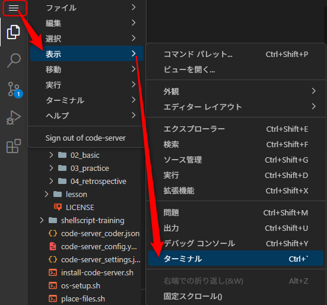

Start - [**1**](step1.md) - [2](step2.md) - [3](step3.md) - [4](step4.md) - [5](step5.md) - [6](step6.md) - [7](step7.md) - End

# 環境を準備する

- VSCodeでターミナルを開きます。


1. ターミナルで以下のコマンドを実行します

```bash
~/ansible-training/assets/tools/setup.sh && source /etc/profile.d/init-env.sh
```

このコマンドを実行することで以下の環境が構築されます。


ここからは、構築した環境を確認していきます。

1. カレントディレクトリを`~/ansible-training/exercise/01_introduction`に変更します

```bash
cd ~/ansible-training/exercise/01_introduction
```

> 以降、本演習では特に指示がない限り、上記ディレクトリをカレントディレクトリとした状態で作業します。  
> テキスト中で「カレントディレクトリ」と記載している場合のディレクトリも上記のディレクトリを指します。  
> カレントディレクトリが誤っているとコマンドが正常に動作しないことがあるため、カレントディレクトリを変更した際はご注意ください。

1. Ansibleが実行できることを確認します。  
これはターゲットサーバへの接続を確認するコマンドです。

```bash
ansible -m ansible.builtin.ping -i inventory all
```

各ターゲットへSSHで接続する際は、以下のコマンドを実行してください。  
接続を確認したら`exit`コマンドを実行して接続解除して元のコンソールへ戻ります。

1号機

```bash
ssh target01 -i /root/.ssh/ansible_lesson_key
```

```bash
exit
```

2号機

```bash
ssh target02 -i /root/.ssh/ansible_lesson_key
```

```bash
exit
```

3号機

```bash
ssh target03 -i /root/.ssh/ansible_lesson_key
```

```bash
exit
```

---

- [前のページに戻る](README.md)
- [目次](README.md)
- [次のページに進む](step2.md)
