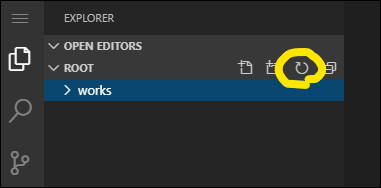

Start - [1](step01.md) - [**2**](step02.md) - [3](step03.md) - [4](step04.md) - [5](step05.md) - [6](step06.md) - [7](step07.md) - [8](step08.md) - [9](step09.md) - [10](step10.md) - [11](step11.md) - [12](step12.md) - End


# 課題1: Ansibleでファイルを収集する

本課題では、簡単なPlaybookの構成と作り方について学んでもらいます。  
題材として、fetchモジュールを使ってファイル収集するPlaybookを作ります。  
本課題は最初の課題のため、コピペだけで作れるようにテキストを作成しています。  
※ファイル収集のイメージ


## 1. Playbookの作成

`exercise/02_basic/playbook_kadai-1.yaml`に以下をコピー＆ペーストします。  
ここでは`kadai-1`ロールを実行するよう定義しています

```yaml
---
- hosts: all
  roles:
    - kadai-1

```

## 2. タスクの作成

`exercise/02_basic/roles/kadai-1/tasks/main.yaml`に以下をコピー＆ペーストします。  
ここでは`kadai-1`ロールのタスクを定義しています。`fetch`モジュールでターゲットサーバのファイルをローカルに取得します。

```yaml
---
- name: fetch 「/etc/passwd」
  ansible.builtin.fetch:
    src: /etc/passwd
    dest: ./kadai-1_fetch_files/

```

## 3. Playbookを実行

```bash
ansible-playbook -i inventory playbook_kadai-1.yaml
```

## 4. 取得したファイルの確認

Playbookを実行すると、`exercise/02_basic/`に`kadai-1_fetch_files`というディレクトリが作成されます。  
その中に各ターゲットサーバごとの`/etc/passwd`ファイルが取得されているのを確認してください。  

※ディレクトリが表示されない場合は、エディタ上の以下の位置にある更新ボタンを押してください。



---

- [前のページに戻る](step01.md)
- [目次](README.md)
- [次のページに進む](step03.md)
