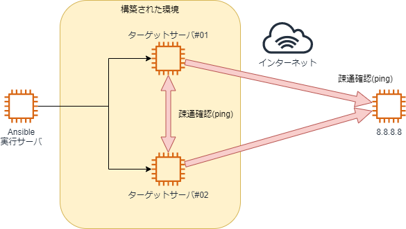

Start - [1](step1.md) - [2](step2.md) - [3](step3.md) - [4](step4.md) - [5](step5.md) - [6](step6.md) - [7](step7.md) - [**8**](step8.md) - End


# 課題7: 動作確認を行うPlaybook

Ansibleは構成管理ツールですが、リモートでコマンドを実行できるという仕様上、動作確認を自動で行うツールとしても使用できます。  
本来の用途と異なる使い方ではあるものの、テストを自動化することはとても有用なため、Ansibleの利用用途の一つとして知っておくとよいです。

## 課題7-1: 疎通確認を行うPlaybook

[課題1-3](step2.md)で行ったアドホックコマンドによるお互いのサーバ間での疎通確認を、`shell`モジュールを使ってPlaybookにしてください。  
実装方法はいろいろ考えられますが、各サーバからの宛先IPを変数で定義できるようにすると簡単かと思います。  
また、疎通確認は他の複数のIPアドレスへ行うことも考えられるため、リストとループを使って実装すると汎用的なPlaybookとして利用可能になります。  
実行のイメージ図は以下の通りです。



各サーバのIPは以下のアドホックコマンドで確認してください。

```bash
ansible -m shell -a "ip a" -i inventory all
```

## 補足: IPアドレス8.8.8.8について

実行のイメージ図に記載している「IPアドレス`8.8.8.8`」はGoogleが提供しているパブリックDNSサービスのIPアドレスです。  
誰でも無料で利用可能なDNSとして知られており、適当なDNSが欲しいときに自分でDNSサーバを用意する手間が省けるため、知っておくと役立つことがあるかもしれません。  
今回のように、インターネットへ通信が出ていけているかを確認する際にも利用できます。

---

- [前のページに戻る](step7a.md)
- [目次](README.md)
- [解説に進む](step8a.md)
